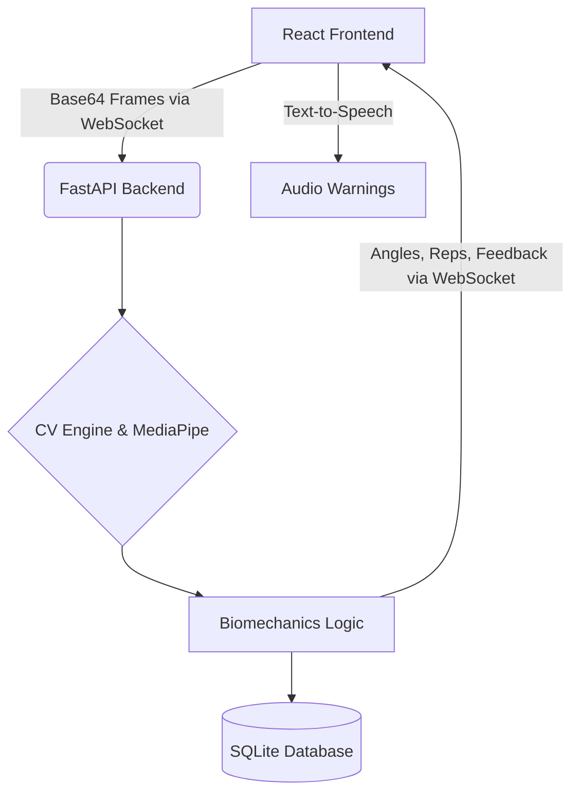

# Athletica AI 🏋️‍♂️

A production-grade Athletica AI web application using Computer Vision, biomechanical analysis, and real-time WebSocket streaming to provide accurate exercise rep counting and posture correction.

## System Architecture



## Features
- **Real-Time Pose Detection**: Uses Google's MediaPipe for precise human skeletal tracking.
- **Biomechanical Angle Calculation**: Calculates specific 3-point joint angles (Hip -> Knee -> Ankle) using cosine distance formulas.
- **Squat Detection State Machine**: Accurately counts reps using an `UP` and `DOWN` state machine preventing double-counting or skipped frames.
- **Text-to-Speech Feedback**: Emits real-time vocal cues for bad posture (e.g. "Keep Back Straight", "Go Lower").
- **Real-Time Low Latency Stream**: Frames are base64 encoded and sent over Python WebSockets achieving <100ms analytics streaming.

## Setup Instructions

### Prerequisites
- Node.js & npm (Frontend)
- Python 3.9+ (Backend)
- A working webcam

### 1. Start the System
You can start both systems instantly using the provided script:
```bash
# On Windows
./start_dev.bat
```

> **Alternatively, to start manually:**
> 
> **Backend:**
> ```bash
> cd backend
> python -m venv venv
> venv\Scripts\activate
> pip install -r requirements.txt
> uvicorn main:app --reload --port 8000
> ```
> 
> **Frontend:**
> ```bash
> cd frontend
> npm install
> npm run dev
> ```

### 2. Demo Instructions
1. Navigate to `http://localhost:5173`
2. Ensure the "AI Coach" dashboard shows **LIVE** in green.
3. Step back from your webcam so your entire body (Hip to Ankle) is visible.
4. Perform a squat! You should hear voice warnings if your form is off or when you complete a successful rep.
